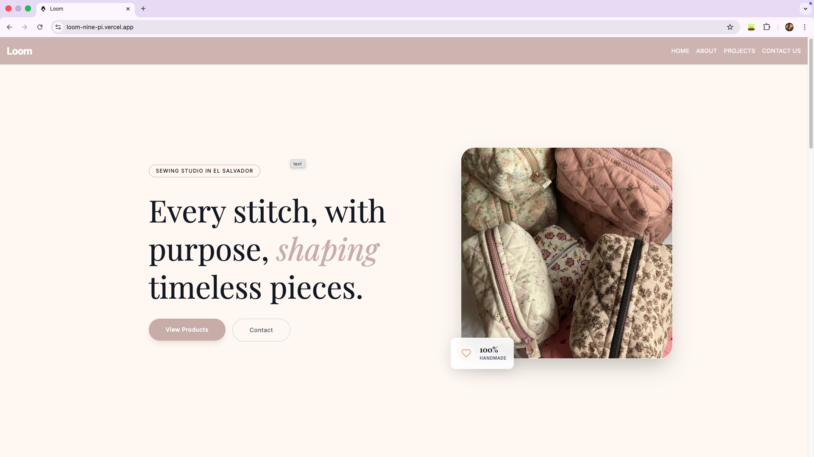
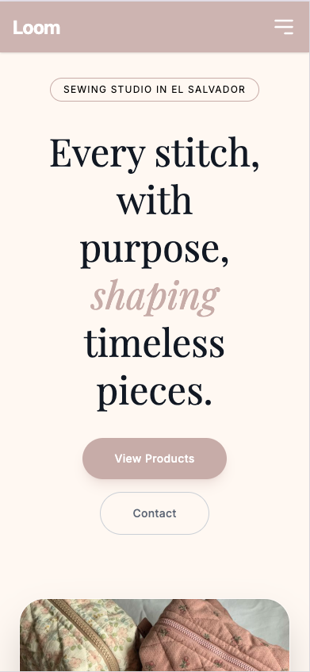

# Loom

## Live Demo

[View Live Project](https://loom-nine-pi.vercel.app)

## Screenshots

### Desktop


### Mobile


---

## Overview

Loom is a modern landing page built as a personal learning project to strengthen my front-end development skills.

This project focuses on component-based architecture using Astro, utility-first styling with TailwindCSS, and responsive design implementation from scratch.

Rather than only replicating a design, this project challenged me to make design decisions while coding and to think critically about layout, spacing, and user experience.

---

## Tech Stack

- HTML
- Astro
- TailwindCSS
- JavaScript

Development Environment:
- Antigravity
- AI assistance with Gemini (used as learning support, not as a code replacement)

---

## Features

- Responsive design (mobile-first approach)
- Sidebar navigation with JavaScript toggle functionality
- Flexbox and Grid layouts
- Consistent spacing system
- Modern UI elements (rounded corners, smooth transitions)
- Minimalist brand-oriented color palette

---

## Design Decisions

- Centered layout to maintain visual clarity and simplicity
- Strategic typography and color contrast to create visual hierarchy
- Consistent vertical spacing (e.g., py-16) for rhythm
- Combined use of Flexbox and Grid depending on layout needs
- Mobile adaptation handled manually through breakpoints

---

## Challenges

### First Time Using TailwindCSS
This was my first experience working with TailwindCSS.  
I gradually learned how to structure utility classes efficiently and identify reusable styling patterns.

### Responsive Design from Scratch
I implemented responsiveness without templates.  
This helped me understand breakpoints, layout restructuring, and user-centered adjustments.

### Sidebar Implementation
Built a responsive sidebar menu using JavaScript to manage state and transitions.

### Version Control Discipline
Although Git and GitHub were used throughout the project, commit frequency was inconsistent during styling phases.  
Future iterations will focus on more structured commit practices.

---

## What I Would Improve (v2)

- Proper pre-development design process (wireframes and documentation before coding)
- Functional contact section
- More interactive UI elements
- Cleaner Git workflow
- Deeper optimization of TailwindCSS structure
- Stronger JavaScript interactivity

---

## Installation

Clone the repository:

```bash
git clone https://github.com/sunzcy0/Loom.git